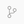

# Walk-through

## Preliminaries

Check that Gitpod has the correct GitHub permissions:

* Visit <https://gitpod.io/integrations>
* For the GitHub entry, click the ellipsis, and click *Edit Permissions*
* Click each permission's checkbox and click *Update Permissions*
* Click *Authorize gitpod-io*

## Getting started

Start a new Gitpod workspace:

* Visit <https://gitpod.io/#https://github.com/opensafely/nhsx-demo>

Install `opensafely`:

```sh
pip install opensafely
```

Generate expected, or "dummy", data:

* Click the *output* directory; notice that it's empty
* Run:

```sh
opensafely run -f run_all
```

* Click the *output* directory; notice that it's not empty any more!
* It contains three types of files:
  * input files (e.g. *output/input_2019-01-01.csv*)
  * measure files (e.g. *output/measure_sbp_by_practice.csv*)
  * a deciles chart file (*output/deciles_chart_sbp_by_practice.png*)

Click *project.yaml*:

* It contains three actions; each action produces the types of files we saw above:
  * The `generate_cohort` action generates the input files from the study definition
  * The `generate_measures` action generates the measure files from the study definition
  * The `generate_deciles_charts` action generates the deciles chart file

Compare the columns in an input file to the study definition:

* It's easiest to do this side-by-side
* Notice that the columns are parameter names of the `StudyDefinition` instance
* Notice the `default_expectations` parameter

Compare the columns in a measure file to the study definition:

* It's easiest to do this side-by-side
* Notice that the columns are parameter values of the `Measure` instance
* Notice the additional `value` and `date` columns

Click the deciles chart file:

* This is generated by the `generate_deciles_charts` action, which in turn calls the *analysis/generate_deciles_charts.py* Python file
* This Python file isn't part of the OpenSAFELY framework
* Notice that the researcher can write code for their study; they're not limited by the OpenSAFELY framework

## Adding a new covariate

Inspect a codelist on [OpenCodelists][]:

* Visit <https://www.opencodelists.org/codelist/opensafely/cholesterol-tests/09896c09/>

Click *codelists/codelists.txt*:

* Add `opensafely/cholesterol-tests/09896c09`
* Run:

```sh
opensafely codelists update
```

Click *analysis/study_definition.py*:

* Copy `had_sbp_event` and `sbp_event_code`
* Rename them `had_cholesterol_event` and `cholesterol_event_code`
* Replace `sbp_codelist` with `cholesterol_codelist`

Regenerate expected, or "dummy", data:

* Run:

```sh
opensafely run -f run_all
```

Click an input file:

* Notice two new columns: `had_cholesterol_event` and `cholesterol_event_code`

## Adding a new measure

Click *analysis/study_definition.py*:

* Copy `Measure`
* Replace `sbp_by_practice` with `cholesterol_by_practice`
* Replace `had_sbp_event` with `had_cholesterol_event`

Regenerate expected, or "dummy", data:

* Run:

```sh
opensafely run -f run_all
```

* Notice that there are new measure files

Compare the columns in a new measure file to the study definition:

* It's easiest to do this side-by-side
* Notice that the columns are parameter values of the new `Measure` instance
* Notice the additional `value` and `date` columns

Click the new deciles chart file:

* As before, this is generated by the `generate_deciles_charts` action
* This action is flexible; it will make a deciles chart from each measures file it finds in the *output* directory

## Requesting a code review

Branch from `main` and commit:

* Click the *Source Control* icon ()
* Press <kbd>f1</kbd> and search for "Create Branch"
* Name the branch e.g. "add-cholesterol-measure"
* Click *study_definition.py*, *codelists.json*, and *codelists.txt*
* Inspect the changes to each file
* Click the plus icon next to each file to stage the changes
* Add a commit message e.g. "Added cholesterol measure"
* Press <kbd>Command Enter</kbd> to commit the changes

Create a pull request:

* Press <kbd>f1</kbd> and search for "Create Pull Request" (The pull request form is broken on Safari.)
* Add a title e.g. "Added cholesterol measure"
* Add a description e.g. "Added cholesterol covariates to the study definition and used these to generate a cholesterol measure."
* Click *Create*
* Visit <https://github.com/opensafely/sro-measures-demo/pulls>
* Assign a reviewer

The reviewer inspects the changes, approves the pull request, and merges the changes into the `main` branch.

## Running on the job server

TODO

## Reviewing and releasing outputs

TODO

[OpenCodelists]: https://www.opencodelists.org/
